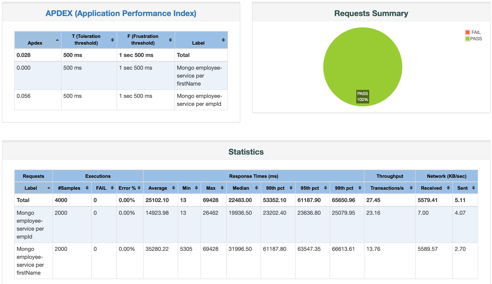
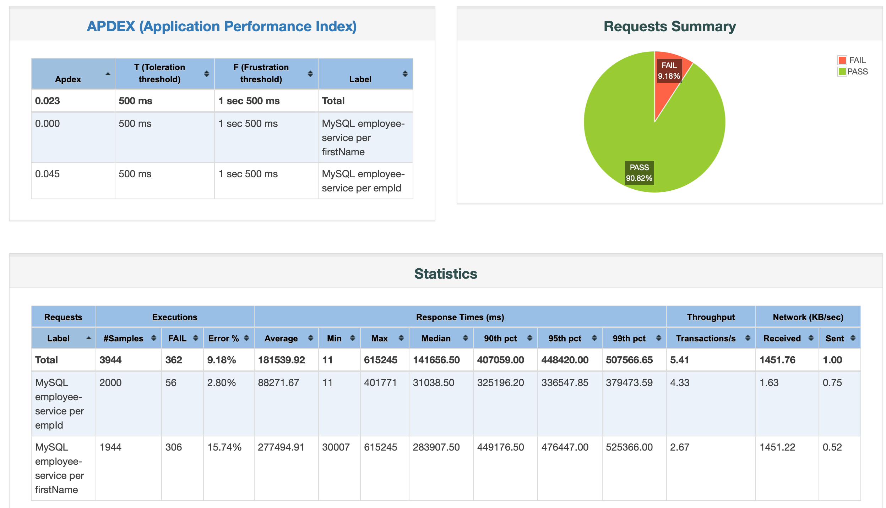
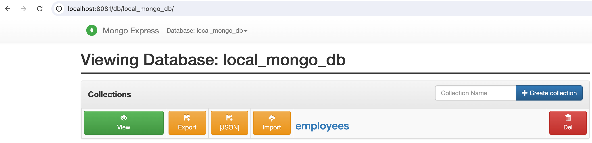
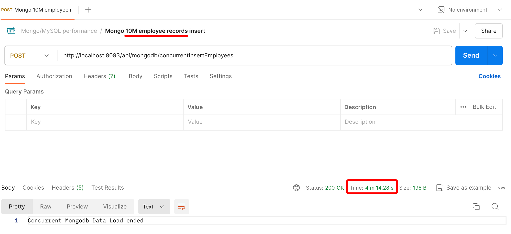
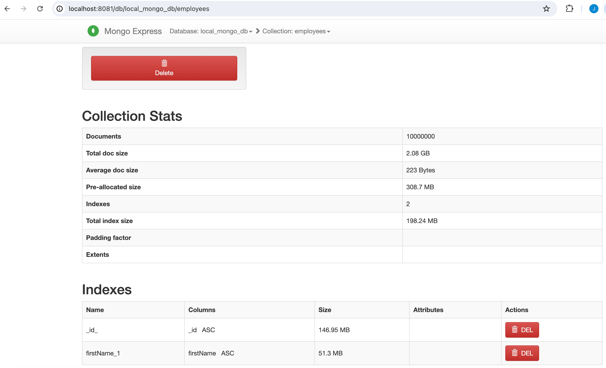
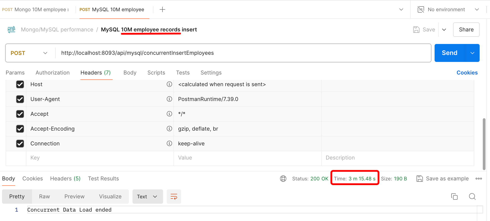
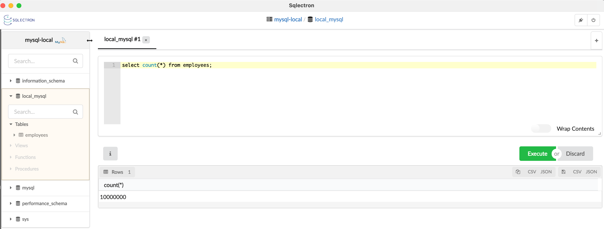
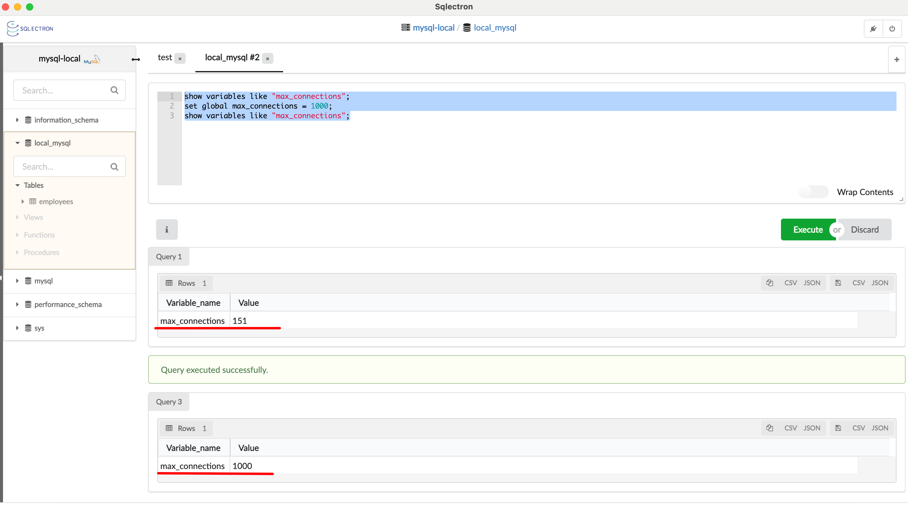
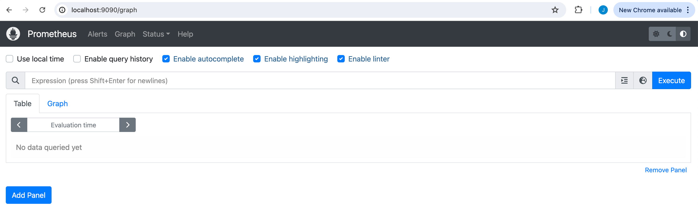
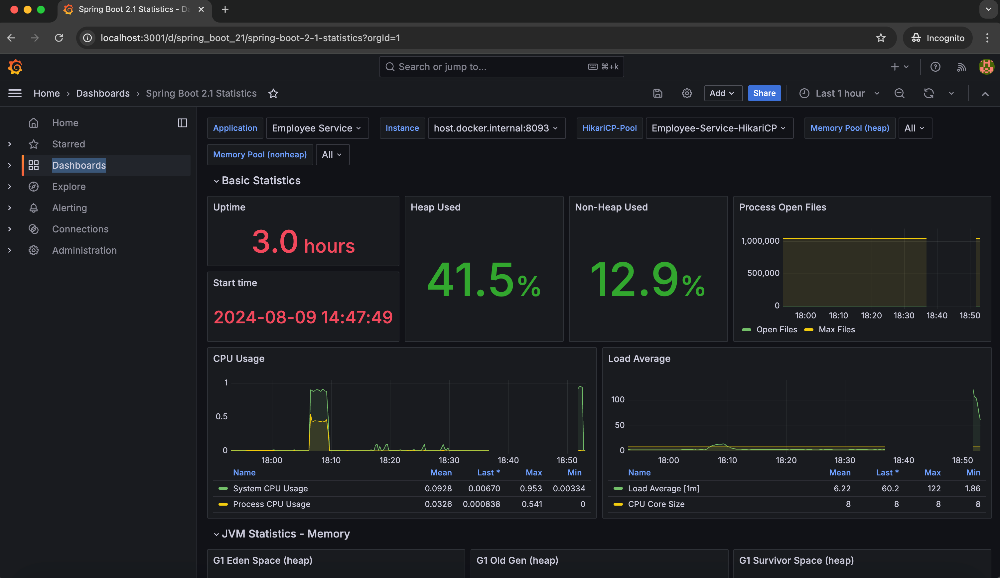

# 1. Load Testing - Spring Boot, MySQL, MongoDB, Prometheus, Grafana, Actuator, JMeter
### Cassandra, PostgeSQL - To do

# 2. Tests summary
## a. DB write/insertion summary:
| S/N | Database  | Total DB records | API endpoint                           | Total process time |
|-----|-----------|------------------|----------------------------------------|--------------------|
| 1   | MongoDB   | 10,000,000       | /api/mysql/concurrentInsertEmployees   | 4 mins and 14.28s  |
| 2   | MySQL     | 10,000,000       | /api/mongodb/concurrentInsertEmployees | 3 mins and 15.48s  |
| 3   | Cassandra | To do            | To do                                  | To do              |
| 4   | PostgeSQL | To do            | To do                                  | To do              |

## b. Load test - DB read/retrieval summary:
| Database          | Total DB records | set DB max_connections(Y/N) | API endpoint                  | Requests per min | Average API response | Total Average<br>API response | No. of errors |
|-------------------|------------------|-----------------------------|-------------------------------|------------------|----------------------|-------------------------------|---------------|
| MongoDB           | 10,000,000       | N/A                         | /api/mongodb/{id}             | 2,000            | 14.9s                | 25.1s                         | 0             |
|                   |                  | N/A                         | /api/mongodb/name/{firstName} | 2,000            | 35.2s                | -                             | 0             |
| MySQL             | 10,000,000       | N                           | /api/mysql/{id}               | 2,000            | 88.2s                | 181.5s                        | 56            |
|                   |                  | N                           | /api/mysql/name/{firstName}   | 1,944            | 277.4s               | -                             | 306           |
| MySQL(fine tuned) | 10,000,000       | Y - max_connections=1000    | /api/mysql/{id}               | 2,000            | 56.2s                | 111s                          | 0             |
|                   |                  | Y - max_connections=1000    | /api/mysql/name/{firstName}   | 2,000            | 165.9s               | -                             | 0             |
| Cassandra         | To do            |                             |                               |                  |                      |                               |               |
| PostgeSQL         | To do            |                             |                               |                  |                      |                               |               |

## c. Load testing reports
### i. MongoDB read/retrieval screenshot

### ii. MySQL read/retrieval screenshot - default max_connections setup

### iii. MySQL read/retrieval screenshot - Set max_connections=1000


# 3. Prerequisite on running this project:
- Install Java 19.
- Install Docker Desktop.
- JMeter - for testing.
- SQL client.

# 4. Tech stacks and service in employee-service project.
- MySQL
- MongoDB
- PostgreSQL - to do
- Cassandra - to do
- employee-service - service to test
- Prometheus
- Grafana

# 5. MySQL/MongoDB/mongo-express credentials
- Located in <employee-service path>/.env

# 6. Steps in running employee-service project.
- Checkout the project in Github.
- Go the project directory.
```bash
cd /<path>/employee-service
```
- Install employee-service.
```bash
mvn clean install
```
- Build all services of employee-service project.
```bash
docker-compose build --no-cache
```
- Start all services of employee-service.
```bash
docker-compose up
```
- View all Docker running containers.
```bash
docker ps -a
```
- Tail employee service logs.
```bash
docker logs <CONTAINER ID of employee-app> --follow
```
# 7. Load testing MongoDB
## a. Initialize records of MongoDB
- mongo-express console URL and login using admin/admin credentials.
```bash
http://localhost:8081/db/local_mongo_db/
```

- Import postman collections from employee-service/_external_files/Mongo-MySQL performance.postman_collection.json.
- Execute POST Mongo 10M employee records insert.
  
- Verify the records inserted via mongo-express console.

## b. Perform MongoDB loadtest
- Copy the JMeter script to JMeter bin directory.
```bash
JMeter script --> employee-service/_external_files/employee-mongo.jmx
JMeter bin --> <JMeter path>/bin
Copy <JMeter script> to <JMeter bin>
```
- Execute the below commands in JMeter bin directory:
```bash
mkdir employee-mongo-report
./jmeter.sh -n -t employee-mongo.jmx -l employee-mongo-report/mongo-loadtest.jtl -e -o employee-mongo-report/
```
- View MongoDB loadtest report in: Refer in section 2-c-i
```bash
<JMeter path>/bin/employee-mongo-report/index.html
```

# 8. Load testing MySQL
## a. Initialize records of MySQL
- Import postman collections from employee-service/_external_files/Mongo-MySQL performance.postman_collection.json.
- Execute POST MySQL 10M employee records insert.

- Verify the records inserted via mongo-express console.

## b. Perform MySQL loadtest with default max_connections
- Copy the JMeter script to JMeter bin directory.
```bash
JMeter script --> employee-service/_external_files/employee-mysql.jmx
JMeter bin --> <JMeter path>/bin
Copy <JMeter script> to <JMeter bin>
```
- Execute the below commands in JMeter bin directory:
```bash
mkdir employee-mysql-report
./jmeter.sh -n -t employee-mysql.jmx -l employee-mysql-report/mysql-loadtest.jtl -e -o employee-mysql-report/
```
- View MySQL loadtest report in: Refer in section 2-c-ii
```bash
<JMeter path>/bin/employee-mysql-report/index.html
```
## c. Perform MySQL loadtest with max_connections=1000. Fine tuned.
- Set MySQL max_connections=1000

- Execute the below commands in JMeter bin directory:
```bash
mkdir employee-mysql-report-max-conn
./jmeter.sh -n -t employee-mysql.jmx -l employee-mysql-report-max-conn/mysql-loadtest.jtl -e -o employee-mysql-report-max-conn/
```
- View MySQL loadtest report in: Refer in section 2-c-iii
```bash
<JMeter path>/bin/employee-mysql-report-max-conn/index.html
```

# 9. Display the metrics of the load test. Not the main scope of this project. I will not go deeper on this.
- Prometheus URL
```bash
http://localhost:9090
```


- Grafana URL
```bash
http://localhost:3001
Dashboard -> New -> New Dashboard -> Import DashBoard
```

